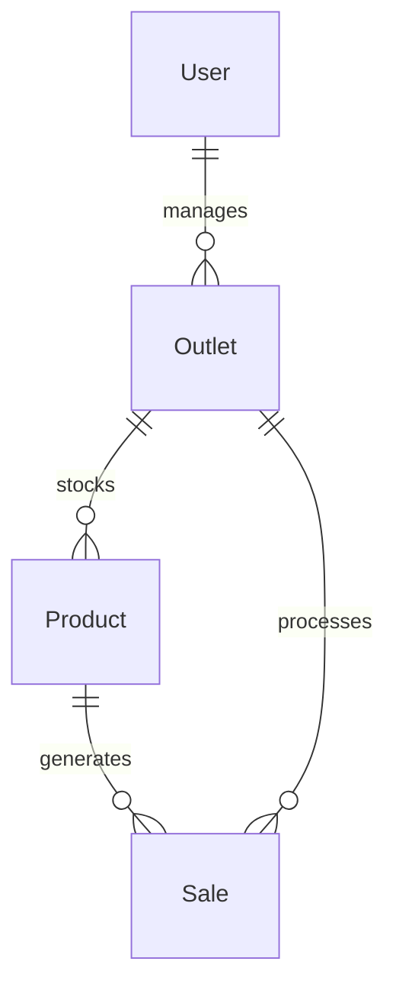

# MetroOps: Metro City Business Multi-Branch Dashboard

MetroOps is a high-performance MERN-stack dashboard application designed for urban retail businesses operating multiple branches across metro cities. It enables real-time synchronization, location management, product inventory tracking, low-stock warnings, and transaction logs on a single unified platform.

---

## 🚀 Tech Stack

- **Frontend**: React.js (Vite), Recharts, Lucide Icons, Vanilla CSS
- **Backend**: Node.js, Express.js
- **Database**: MongoDB (Mongoose ORM)
- **Security**: JWT-based session protection, bcryptjs password hashing

---

## 🌟 Key Features

1. **Live Analytics & Polling**:
   - The dashboard queries the backend `/sales/analytics` endpoint and performs silent background polling every 8 seconds (indicated by a pulsing green dot) to sync and refresh transaction charts in real time.
2. **Data Visualizations (Recharts)**:
   - **Revenue Trend Line**: 7-day rolling revenue chart.
   - **City Bar Graph**: Grouped sales comparing performance in different metro cities.
   - **Category Distribution Pie**: Highlights proportional breakdown of item sales.
   - **Outlet Revenue Comparison**: Horizontal charts plotting individual branch efficiency.
3. **Protected CRUD for Outlets & Inventory**:
   - Add, edit, or delete outlets and products directly from list screens.
   - Cascading deletions: Deleting an outlet automatically deletes all associated products and transactions to maintain database integrity.
4. **Interactive POS Checkout Form**:
   - Allows recording sales with live product list fetching based on the chosen outlet, available stock display, and quantity validation.
5. **Low Stock Alerts**:
   - Highlights items with stock levels $\le 10$ with warning indicators and updates the alert feed on the dashboard automatically.

---

## 🏗️ Architecture & Data Model



### Schemas

- **User**: Manager/admin accounts with encrypted passwords.
- **Outlet**: Physical branch name, metro city location, address, and contact number.
- **Product**: Items belonging to specific outlets, tracking SKU, price, and stock levels.
- **Sale**: Captures transactions in real-time, detailing quantity, total calculated value, and timestamp.

---

## 🔑 Seeding & Test Credentials

The database has been seeded with mock outlets, products, and sales records across 5 metro cities (Mumbai, Delhi, Bangalore, Kolkata, Chennai).

Use the following credentials to log in:
- **Email**: `manager@metro.com`
- **Password**: `password123`

---

## ⚙️ How to Run the Project Locally

### 1. Prerequisites
- Node.js installed on your machine.
- An internet connection to reach the Atlas database (configured in `backend/.env`).

### 2. Run the Backend Server
From the project root:
```bash
cd backend
npm start
```
*The API runs at **http://localhost:5000**.*

### 3. Run the Frontend Client
From the project root in a new terminal window:
```bash
cd frontend
npm run dev
```
*The Vite development server runs at **http://localhost:5173**.*